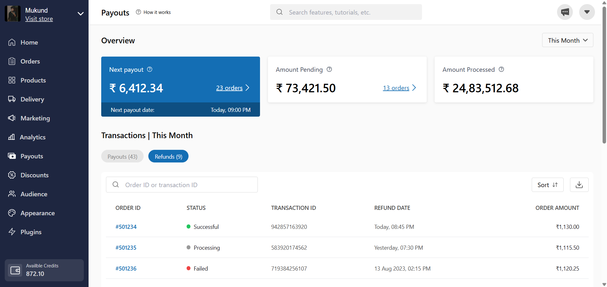

# Dukaan UI Frontend





A modern and responsive user interface inspired by Dukaan, built using React and styled entirely with Tailwind CSS. This project showcases various custom components such as BlueCard, RevenueCard, Sidebar, Topbar, and more—all designed to deliver a clean, intuitive UI.

## Table of Contents

- [Tech Stacks](#tech-stacks)
- [Features](#features)
- [Demo](#demo)
- [Installation](#installation)
- [Usage](#usage)
- [Contributing](#contributing)
- [License](#license)
- [Notes](#notes)

## 🔧 Tech Stacks

- **React:** For building interactive user interfaces.
- **Vite:** A lightning-fast build tool.
- **Tailwind CSS:** For rapid and efficient styling using utility classes.

## ✨ Features

- **Responsive Layout:** Ensures a seamless experience across devices.
- **Custom UI Components:**  
  - **BlueCard & RevenueCard:** Display key metrics with interactive elements.  
  - **Sidebar & Topbar:** Navigation components with dropdowns and icons.  
  - **Table & Transactions:** Organized views for orders, payouts, and transactions.
- **Interactive Elements:** Hover effects and dynamic content built with Tailwind CSS.

## 🚀 Demo

[View Live Demo](https://dukaan-ui-frontend-one.vercel.app/)

## 🛠️ Installation

### 1. Clone the Repository

```bash
git clone https://github.com/YourUsername/Dukaan-UI-Frontend.git
cd Dukaan-UI-Frontend
```

### 2. Install Dependencies

```bash
npm install
```

### 3. Run the Application

```bash
npm run dev
```

Then open [http://localhost:5174](http://localhost:5174) in your browser.

## 📚 Usage

This project serves as an example of how to implement a modern, component-based UI using React and Tailwind CSS. You can explore the different components (such as BlueCard, Sidebar, and Transactions) to understand their structure and styling, then use or adapt them for your own projects.

## 🤝 Contributing

Contributions are welcome! To contribute:

1. **Fork the Repository**
2. **Create a Feature Branch:**  
   `git checkout -b feature/YourFeature`
3. **Commit Your Changes:**  
   `git commit -m "Add feature description"`
4. **Push to the Branch:**  
   `git push origin feature/YourFeature`
5. **Open a Pull Request**

## 📄 License

This project is licensed under the MIT License. See the [LICENSE](LICENSE) file for details.

## 📝 Notes

This project was created as part of my journey to learn Tailwind CSS and modern frontend development. It showcases various UI elements and interactive components. Feel free to reach out if you have any questions or suggestions!
